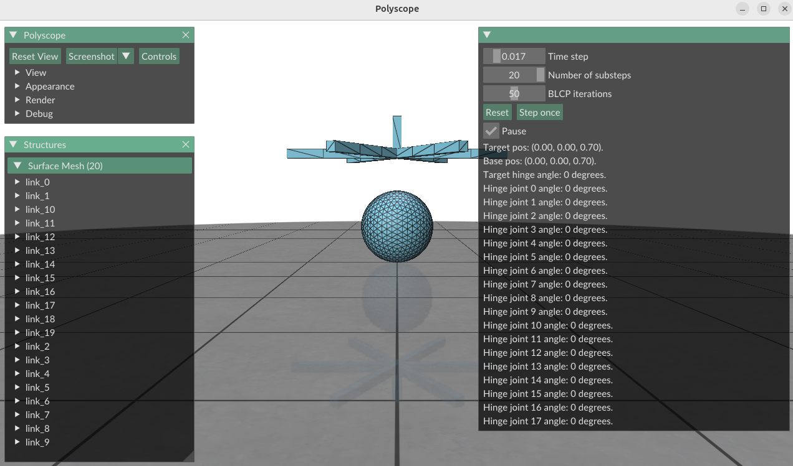
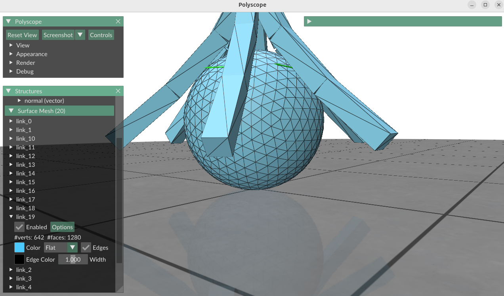
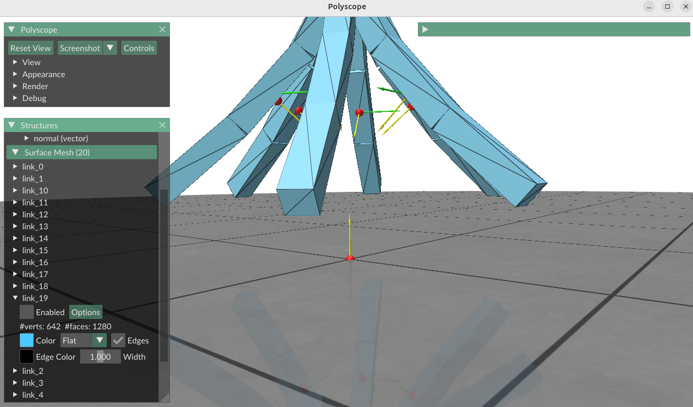

# Physics-Based Simulation Homework: Constrained Dynamics

## Environments and Dependencies
We develop and maintain this codebase in Ubuntu 22.04/24.04. The dependencies (see below) are cross-platform, so it should be relatively easy to compile the codedbase on other Ubuntu versions or operation systems (e.g., Windows/macOS). The dependencies include
- [Eigen](https://gitlab.com/libeigen/eigen.git): a C++ linear algebra library. We have already included it in this codebase as a submodule;
- [Polyscope](https://github.com/nmwsharp/polyscope): a C++/Python visualizer for 2D/3D data. We have already included in this codebase as a submodule.
- Basic C++ build toolchain: make, g++, cmake, etc. Run
```
sudo apt-get install build-essential
```
if you do not have them on your computer.

## Installation Guide
- Use git to clone the codebase:
```
git clone --recursive https://github.com/taodu-eecs/phys_sim_constrained_dynamics.git
```
- Run **from the root folder (the folder that contains this README.md file)** `./build.sh` to compile the code and run the main program. If everything goes well, a window like the screenshot below will pop up:

The layout of these panels may differ on your computer.

If you encounter compilation or runtime errors, check [Polyscope's building guide](https://polyscope.run/building/) and [Eigen's guide](https://eigen.tuxfamily.org/dox/GettingStarted.html) first. Contact our teaching assistant if you still cannot resolve the issue.

## Programming Tasks
This homework invites you to code up core algorithms in constrained rigid body dynamics with frictional contacts, and we have marked them with a `TODO` label in the given framework. Most of them require only a few lines of C++ code, and we suggest you read the lecture slides and the comments before the `TODO` labels carefully before you start. If you have trouble finishing them, we encourage you to come and visit us during our office hours.

### Task 1 (6 points): Joint constraints
Read the `Link` base class in `cpp/link` and the `Joint` base class in `cpp/joint`.
- Task 1.1 (2 points): finish the `TODO` in `Link::ComputePointJacobian` to implement the Jacobian matrix for a point in the body frame of a link.
- Task 1.2 (2 points): implement the `TODO` in `BinaryHingeJoint::phi` to define a hinge joint between two links.
- Task 1.3 (2 points): implement the `TODO` in `Link::Jphi` that describes the Jacobian matrix of the constraint function `BinaryHingeJoint::phi`. You can use the `Link::ComputePointJacobian` function.

### Task 2 (6 points): Constrained dynamics
Read the `Simulator` class in `cpp/sim` and finish implementing the following functions needed in its core `Step` function.
- Task 2.1 (2 points): implement `Link::ToWorldInertia` function to compute the inertia tensor of a link in the world frame.
- Task 2.2 (2 points): implement `Simulator::ComputeMomentumMatrix` to form the mass matrix for all links in `Simulator`.
- Task 2.3 (2 points): implement `Simulator::ComputeMomentumVector` to form the right-hand side vector from the Newton-Euler equations in their matrix forms.

The simulator now has everything it needs to simulate the gripper with joint constraints. You can check it by running `./build.sh` and click `Step once`: the gripper fingers should fall down in response to gravity, but the links should not fall apart. We have provided a reference video `asset/doc/constrained_dynamics.mp4` for your reference.
<video controls>
    <source src="asset/doc/constrained_dynamics.mp4" type="video/mp4">
</video>

You will also notice that the sphere falls under the ground and the penetration between the falling gripper fingers and the sphere. Your next task will add support for collision and contact.

### Task 3 (6 points): Collision detection
Read the `ContactProxy` base class and the `CollisionDetector` class in `cpp/contact` and finish the following tasks:
- Task 3.1 (3 points): read `SphereContactProxy` and implement `CollisionDetector::DetectSpherePlaneCollisions`. We have provided some instructions in its comments. This function detects the collision between the sphere and the ground plane in the main program.
- Task 3.2 (3 points): read `BoxContactProxy` and implement `CollisionDetector::DetectSphereBoxCollisions`. This function detects the collision between the gripper fingers and the sphere in the main program.

You can check your implementation by visualizing the local frames and the collision points: run `./build.sh` and click `Step once` until you suspect collisions should appear. You can disable `link_19` (the sphere) in `Structures` -> `Surface Mesh` from the user interface and view the collision point (red dots) and the local frames (yellow and green arrows). We provide the two screenshots with and without `link_19` for your reference:



### Task 4 (2 points): Gripper manipulation
If all your implementations are correct, you should be able to run the main program and instruct the gripper to grasp and carry the sphere.
- Task 4.1 (2 points): read `cpp/main.cpp` to figure out how to control the gripper from your keyboard. Record and submit a video `video.mp4` that shows the gripper can grasp the sphere and lift it above the ground. We have provided an example video `asset/doc/video.mp4` for your reference. You can use either the screenshot function in `cpp/main.cpp` and `export_video.sh` or simply the camera on your smartphone to record the video.

<video controls>
    <source src="asset/doc/video.mp4" type="video/mp4">
</video>

### Bonus (0 points)
We encourage you to add more features to the current framework. A few possible extensions to the current framework include:
- An obvious extension is to add more joint types in `cpp/joint/` and demonstrate it in a new scene of your choice.
- You are also welcome to create your own scene with the existing joints, e.g., a cart pole, a unicycle, a dexterous hand, or a legged robot.
- Add support for [anisotropic frictions](https://siggraphcontact.github.io/assets/files/SIGGRAPH22_friction_contact_notes.pdf) in the current BLCP framework and design a new scene to demonstrate its efficacy.
- You can also replace the current PID controller with more advanced controllers, e.g., exposing the C++ simulator to Python using [pybind11](https://github.com/pybind/pybind11) and run deep reinforcement learning to train a better controller.
- The joint motions in the current framework suffer from instabilities in the transient directions, which is explained in previous papers like [Stable Constrained Dynamics](https://team.inria.fr/imagine/files/2015/05/final.pdf). Design a test scene to showcase such instability and implement Eq. (21) in the paper to resolve this issue.
- Any other creative ways of using this framework in your own research field are welcome.

## Submission Guide
Name your video in Task 4 as `video.mp4` and create a folder `submission` that includes the following files:
```
submission/:
- video.mp4
- link.cpp
- binary_hinge_joint.cpp
- simulator_step.cpp
- collision_detector.cpp
```
Compress the folder into `submission.zip` and submit it to [Web Learning](https://learn.tsinghua.edu.cn/). If you place `video.mp4` in the root folder, you can run
```
./submit.sh
```
to automate this process (Read `./submit.sh` for details). **It is your responsibility to double check** that your `submission.zip` contains the correct source code files with your implementation. Email `submission.zip` to taodu@tsinghua.edu.cn or our Teaching Assistant if you miss the deadline but still have late days left. We do not accept submissions in any other formats.

We won't grade bonus implementations, but you are more than welcome to discuss them with the teaching staff during our office hours or explore them in your course project.

## Acknowledgments
The user interface, collision, and contact code framework of this homework is based on the [codebase](https://github.com/siggraphcontact/rigidBodyTutorial) from the [SIGGRAPH'22 Course on Contact and Friction Simulation for Computer Graphics](https://siggraphcontact.github.io/).